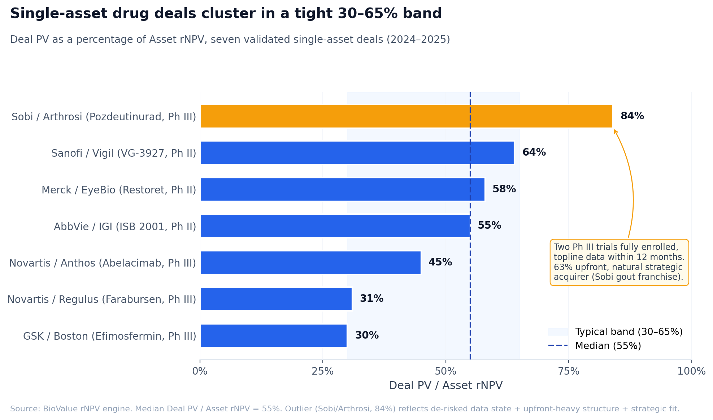

# Single-asset drug deals are more predictable than they look

*Seven recent deals, one tight band, and what the empirical norms tell BD and buy-side analysts.*

Seven single-asset drug deals signed between mid-2024 and late-2025. Five therapeutic areas. Stage at signing ranging from Phase II to fully-enrolled Phase III. Upfronts from $470M to $1.3B. Disparate enough that any reasonable analyst would call them apples and oranges.

Run them all through the same risk-adjusted valuation framework, though, and the deal economics land in a tight, predictable band. Median Deal PV, which is upfront cash plus risk-adjusted milestone PV plus royalty stream PV, sits at **55% of standalone Asset rNPV**. Six of the seven fall between 30% and 65%. The seventh, which has the lightest milestone weighting in the set, sits at 84%.

This is not what the industry tells you. The favorite line at every biotech conference is that drug valuation is more art than science: that deals are too idiosyncratic, that single-asset transactions are too dependent on private information and strategic fit to model in any meaningful way. There is something to that argument for *platform* deals and *cell-and-gene-therapy* deals, where the underlying cash-flow shape isn't an annuity. But for clean, single-asset transactions in well-understood therapeutic areas, the pattern is more predictable than the trade press suggests.

This is the first of four posts working through what we learned trying to value recent deals from the ground up. The next three cover the cases where the framework breaks: biomarker stratification, cell and gene therapy, and platform deals. This one is the foundation. What does the framework look like when it's working, and what does it tell us about the norms in clean single-asset deals.

## The three-value framework

Three numbers anchor any single-asset valuation.

**Asset rNPV** is the full standalone risk-adjusted NPV of the asset at the acquirer's WACC, with full peak revenue and full cumulative probability of approval. This is what the asset is worth to an owner-of-100% under their own discount rate. It is the upper bound on what a rational acquirer would pay in isolation, before any deal structuring.

**Commercial-adjusted rNPV** is the same engine, re-run with a conservative fixed haircut: WACC of 14% (the BD function's realistic hurdle, not the corporate WACC), peak revenue scaled to 60% (reflecting analyst forecast bias), and a commercial PoS of 85% applied post-approval (reflecting the empirically observed ~15% commercial failure rate of approved drugs[^1]). This is the BD-realistic lower bound. It is not a downside scenario in the Bear/Base/Bull sense. It is a structural adjustment that captures five well-documented drivers of deal-level conservatism: forecast bias, commercial execution risk, WACC differential, information asymmetry, and integration costs.

**Deal PV** is the present value of the actual deal structure. Upfront cash, plus risk-adjusted regulatory milestone PV (face × cumulative launch probability × discount factor over time-to-launch), plus risk-adjusted sales-milestone PV (face × launch probability × sales-threshold probability × longer discount window), plus royalty stream PV for licensing deals (royalty rate × probability-weighted commercial revenue PV).

The upper bound (Asset rNPV) and lower bound (Commercial-adjusted) define the analytical range. Deal PV is the empirical landing point inside that range. Where Deal PV sits tells you something specific about how risk-sharing was negotiated.

## The seven deals

Here is the validation set. All single-asset deals where the lead asset clearly drives the economics, all signed in the eighteen months ending late 2025, all modeled from the ground up in [BioValue](https://nealvybe.github.io/biovalue/), an open-source rNPV calculator, using public press releases, analyst consensus peak forecasts, and MIT Project ALPHA's biomarker-stratified probability-of-success database[^2].

| Deal | Stage | Asset rNPV | Comm-adj | Deal PV | Deal PV / rNPV |
|---|---|---:|---:|---:|---:|
| Sobi / Arthrosi (Pozdeutinurad) | Phase III | $1.39B | $323M | $1.17B | **84%** |
| Novartis / Anthos (Abelacimab) | Phase III | $3.62B | $1.10B | $1.64B | 45% |
| Merck / EyeBio (Restoret) | Phase II | $2.68B | $803M | $1.55B | 58% |
| GSK / Boston (Efimosfermin) | Phase III | $4.92B | $1.48B | $1.50B | 30% |
| Novartis / Regulus (Farabursen) | Phase III | $4.05B | $1.21B | $1.26B | 31% |
| AbbVie / IGI (ISB 2001) | Phase II | $2.20B | $695M | $1.20B | 55% |
| Sanofi / Vigil (VG-3927) | Phase II | $747M | $235M | $477M | 64% |

Median Deal PV / Asset rNPV: **55%**. Six of seven sit 30–65%. The outlier, Sobi / Arthrosi at 84%, has the lightest milestone weighting in the entire set: $950M of $1.5B total is upfront, leaving only $550M in contingent biobucks. The deal also has the cleanest near-term clinical risk (two Phase III trials fully enrolled at signing with topline data expected within twelve months), so the light risk-sharing is consistent with the data state.

The pattern holds across therapeutic areas. Pozdeutinurad is rheumatology, Abelacimab cardiovascular, Restoret ophthalmology, Efimosfermin hepatology, Farabursen nephrology, ISB 2001 hematology, VG-3927 CNS. Different patient pools, different competitive structures, different pricing dynamics. Same Deal PV / Asset rNPV band.

It also holds across stage. Phase II deals (Restoret, ISB 2001, VG-3927) and Phase III deals (Pozdeutinurad, Abelacimab, Efimosfermin, Farabursen) don't separate into distinct clusters. Stage matters enormously for *absolute* valuation. Asset rNPV for Phase III is structurally higher than Phase II in the same indication because cumulative LoA from Phase III is much higher. But stage doesn't strongly affect the *ratio* of Deal PV to Asset rNPV.

The headline numbers, by contrast, span enormous ranges. Upfronts span 2.8× ($470M to $1.3B). Total biobucks span 5.4× ($590M to $3.1B). The Asset rNPVs we compute span 6.6× ($747M to $4.92B). On those metrics, the deals look completely incomparable. The ratio collapses that variance because it is measuring the same thing in each deal: how much of the asset's standalone value the acquirer was willing to commit in present-value terms, given the asset's risk profile.

## Why the dispersion is narrower than it looks

Five forces push Deal PV down from Asset rNPV toward the BD-realistic lower bound. Together they account for the typical 35–70% reduction visible in the band.

**Forecast bias.** Analyst consensus peak forecasts systematically overstate realized peaks. The reasons are well-documented: priors weighted toward best-in-class outcomes, marketing-department influence on the consensus, anchoring on the most successful comparable launch, and selection bias in which forecasts get published. Across published peak forecasts that have aged through actual launches, the empirical haircut is roughly 30–40% on average[^3]. The Commercial-adjusted framework uses peak × 0.60, a 40% haircut, as a structural adjustment rather than as a downside scenario.

**Commercial execution risk.** Roughly 15% of FDA-approved drugs fail to achieve commercial viability. The failure modes are label restrictions that don't match the development thesis, reimbursement failures, post-marketing safety findings, or competitive displacement faster than the launch curve absorbs. This is distinct from PoS-to-approval. The Commercial-adjusted framework applies a 0.85 multiplier on top of cumulative launch probability to capture it.

**WACC differential.** The BD function generally applies a hurdle rate above the corporate WACC. A large-pharma corporate WACC of 8–10% reflects the firm's overall capital cost. The BD hurdle, typically 12–14%, reflects the additional risk premium specific to external acquisition, where the buyer is taking on integration risk and information asymmetry that internal R&D wouldn't carry. Commercial-adjusted uses a fixed 14% to apply this differential consistently across deals.

**Information asymmetry.** The seller knows things the buyer doesn't. Public data is the upper bound on what the buyer can see. The seller has internal forecasts, additional safety and efficacy data, pipeline interactions, and tacit operational knowledge that don't make it into the data room. Acquirers price for that gap.

**Integration friction.** Not all of an asset's standalone economic value transfers cleanly into the acquirer's P&L. Sales force overlap, manufacturing duplication, regulatory transition costs, and the time it takes to fold a new asset into commercial operations all extract some fraction of standalone value. The literature suggests 10–20% of standalone NPV[^4].

Together, these five forces produce the typical 65–75% gap between Asset rNPV and Commercial-adjusted rNPV. Deal PV usually settles inside that range. Closer to Asset rNPV when the deal is upfront-heavy (light risk-sharing, clean asset), closer to Commercial-adjusted when the deal is milestone-heavy (heavy risk-sharing, riskier asset).

## How to use this in practice

Three patterns to watch for.

**Deal PV substantially above Asset rNPV.** If a single-asset deal is being struck more than 20% above standalone, the most likely explanations are (a) the asset has platform exposure that doesn't show up in single-asset rNPV, where the buyer is paying for pipeline, manufacturing, or scientific capability beyond the lead asset, (b) the acquirer has private peak conviction that materially exceeds analyst consensus, or (c) competitive auction or strategic urgency has lifted price above standalone rationality. The Lilly / Verve transaction (Phase I cardiometabolic CGT) sat at roughly 525% of standalone rNPV when we tried to model it as a single-asset deal. Clearly a platform transaction. We dropped it from the validation set. *Post 4 covers platform deals.*

**Deal PV substantially below Commercial-adjusted.** If a single-asset deal is struck below 25% of Asset rNPV, the explanation is usually that the deal is heavily back-loaded into contingent milestones the acquirer doesn't actually expect to pay. Milestones at thresholds the asset is unlikely to hit, or treated by the acquirer as cheap options on outcomes they don't price into base-case strategy. This is a structural feature of the deal, not undervaluation.

**Deal PV inside the band but with an unusual upfront / milestone mix for the stage.** This is data-state-at-signing doing the work. Pozdeutinurad's 63% upfront share is unusually high for a Phase III asset, but the asset entered the deal with two Phase III trials fully enrolled and topline expected within twelve months. The acquirer was willing to pay more upfront because the contingent risk window was small. Abelacimab's 30% upfront share is unusually low for Phase III, but the Phase III trials had not yet read out and the safety-differentiation thesis was still unproven; heavier milestone weighting was the rational response.

## A closer look at the upper end of the band

The Pozdeutinurad case is worth developing because its 84% Deal PV / Asset rNPV is the highest in the validation set and shows what the framework predicts when three drivers stack in the same direction.

**Data state at signing was unusually de-risked.** Two Phase III trials fully enrolled with topline data expected within twelve months. Compare to other Phase III deals in the validation set: Abelacimab had three Phase III trials enrolled but none with readouts and 24+ months from data; Efimosfermin had Phase 2b complete and Phase III being designed (four-plus years from data); Farabursen had Phase 1b complete and was skipping Phase II entirely (four-plus years from approval). Pozdeutinurad was the closest deal in the validation set to commercial launch. When the acquirer is twelve months from clinical readout instead of four or five years, two things happen simultaneously. Cumulative probability of success is structurally higher because most of the Phase III risk has already been retired. And the discount factor on the bulk of future cash flows is less severe because those cash flows arrive sooner. Both push Deal PV closer to Asset rNPV.

**Deal structure was upfront-heavy because risk was retired.** $950M of $1.5B in upfront cash equals 63% of total deal value, the highest upfront share in the validation set. The mechanism is straightforward: when contingent risk is small, the optionality value of milestone payments to the acquirer drops. Back-loading $550M into a milestone pool that mostly pays out within 18 months wasn't useful to either side. Paying more upfront in exchange for a smaller total deal was economically rational for both. The 63% upfront / 84% Deal PV pairing is internally consistent.

**Strategic fit reduced integration friction to near zero.** Sobi already had Krystexxa (pegylated uricase, IV) for chronic refractory gout. Pozdeutinurad slots in as the oral first-line option with Krystexxa as the IV escalation for severe disease, creating a sequential therapeutic strategy where Sobi captures the patient through their full disease course. Commercial infrastructure investment is minimal: same rheumatologist call points, same specialty pharmacy network, same payer access work. Most acquirers would have needed to build that organization at $100–200M of capability cost over 2–3 years. Sobi's marginal cost of commercialization for pozdeutinurad was near zero, which is the same strategic-acquirer-premium effect documented in post 4 (the platform-deal post), showing up here inside what is structurally a single-asset deal.

The 84% ratio is what the framework predicts when all three drivers stack: late-stage data maturity, upfront-heavy structure, and natural strategic acquirer. The corollary is that when the three drivers diverge or one points against, Deal PV settles closer to the 30–65% band median. Efimosfermin and Farabursen, both Phase III with strong assets but earlier in their data trajectory and without the same level of strategic fit, sit at 30–31%. Same framework, different inputs, different output. The variance within the band is mostly explained by these three drivers, which is why the band is tight enough to be useful as a diagnostic.

This is what tractable looks like in practice. Not a deterministic model that produces one answer, but a band tight enough that exceptions become interpretable.

## Where the framework breaks

This holds for clean single-asset deals in well-understood therapeutic areas with chronic-drug commercial shapes. It breaks in three specific places, each of which is the subject of one of the next three posts.

**Biomarker stratification.** The universal analyst rule of "+15–25 percentage points on PoS for biomarker selection" is wrong in specific cases. The MIT ALPHA data shows that in hematology, biomarker-selected Phase II to Phase III transitions are actually *lower* than unselected. Applying the conventional premium to a heme asset overstates value. *Post 2.*

**Cell and gene therapy.** The chronic-drug PV shape (12-year life, 5-year ramp, terminal LoE haircut) doesn't describe how CGT generates cash. There is no LoE for the same patient because you treat them once. Manufacturing capacity is the binding constraint. Pricing is structured differently. Two CGT deals we tried to fit (Neurona at 180% of standalone, Verve at 525%) showed the framework failing in real time. *Post 3.*

**Platform deals.** When the lead asset is a fraction of total deal value, single-asset rNPV is the wrong tool. Most published deal comp tables conflate platform deals with single-asset deals, which is why "the market is paying 3–5× rNPV" is a common but wrong conclusion. *Post 4.*

## Closing

The art-vs-science framing for drug valuation is mostly self-protective mystique. For the dominant case, single-asset deals in chronic-drug therapeutic areas, the empirical pattern is tight enough to be a real benchmark. A median 55% Deal PV / Asset rNPV ratio across 2024–2025 single-asset deals is not a coincidence. It is what you get when you discount the structural drivers of deal-level conservatism honestly.

The corollary is that the cases where the framework fails are useful in their own right. When a deal's economics fall outside the band, that's not random. It is a signal of platform exposure, atypical cash-flow shape, or differential information. Knowing the norm makes the exceptions easier to read.

---

*The seven validated deals and the three-value framework are part of an open-source rNPV tool called [BioValue](https://nealvybe.github.io/biovalue/). Inputs, outputs, and source data are public. Every number in the table above can be reproduced by loading the corresponding deal preset and reading the Deal Analysis tab. If you want to pressure-test the assumptions on a different asset, the same engine runs in the browser.*

---

## Footnotes

[^1]: Commercial failure rates for approved drugs are documented across multiple post-approval cohort studies. The 15% figure is conservative; some analyses (Onakpoya 2016 on withdrawn drugs; Lexchin 2014 on under-performing launches) put it higher when broader definitions of commercial failure are used.

[^2]: MIT Project ALPHA database, snapshot 2025-12-28. Industry-sponsored, biomarker-stratified phase-transition probabilities by therapeutic area. ALPHA reports a combined P(Phase III → Approval) which we split into P(III → NDA) × P(NDA → Approval) using a fixed 0.91 NDA-to-Approval rate.

[^3]: Peak forecast accuracy literature: Stern et al. (Drug Discovery Today 2020) found median absolute error of 41% in oncology peak forecasts five years post-launch; Schulze & Ringel (Drug Discov World 2013) reported similar magnitudes across general specialty markets. Forecast revisions tend to migrate downward over a launch's first three years.

[^4]: M&A integration cost literature in pharma is thinner than general M&A literature but the ranges align. Danzon, Epstein, Nicholson (Strategic Management Journal 2007) found 10–18% NPV erosion attributable to integration friction in large biotech M&A; KPMG Healthcare M&A surveys (2018–2023) report similar magnitudes from acquirer post-mortems.

## Sources

1. **MIT Project ALPHA database.** Clinical development success rates, biomarker-stratified by therapeutic area. https://projectalpha.mit.edu/pos/
2. **Wong CH, Siah KW, Lo AW.** "Estimation of clinical trial success rates and related parameters." *Biostatistics* 2019, 20(2): 273–286.
3. **Sertkaya A, Beleche T, Jessup A, Sommers BD.** "Examination of Clinical Trial Costs and Barriers for Drug Development." *JAMA Network Open* 2024, 7(6): e2415988.
4. **Chandra A, Mazumdar T.** "The Cost of Drug Development Revisited." Analysis Group / *Journal of Investment Management* 2024.
5. **Sobi / Arthrosi** acquisition press releases and Phase III enrollment updates (BioSpace, Fierce Biotech), December 2025.
6. **Novartis / Anthos** acquisition press release, February 2025. Abelacimab Phase III status (MAGNETIC-AF, MAGNETIC-VTE, ASTER).
7. **Merck / EyeBio** acquisition press release, July 2024. Restoret SPECTRA trial data presented at ASRS 2024.
8. **GSK / Boston Pharmaceuticals** efimosfermin licensing press release, May 2025; closing press release, July 2025.
9. **Novartis / Regulus Therapeutics** farabursen acquisition press release, April 2025.
10. **AbbVie / Ichnos Glenmark Innovation** ISB 2001 licensing press release, July 2025. Phase 1 data, ASCO 2025.
11. **Sanofi / Vigil Neuroscience** VG-3927 acquisition press release, May 2025; closing press release, August 2025.

## Glossary

- **Asset rNPV.** Risk-adjusted Net Present Value of an asset's standalone cash flows at the acquirer's WACC, with full peak revenue and full cumulative launch probability.
- **BD.** Business Development. The function inside pharma responsible for in-licensing, M&A, and partnerships.
- **Biobucks.** Total nominal deal value including all contingent milestones, regardless of probability of payment.
- **CGT.** Cell and Gene Therapy.
- **Comm-adj rNPV.** Commercial-adjusted rNPV. Asset rNPV recomputed with a fixed BD-realistic haircut: WACC 14%, peak × 0.60, commercial PoS × 0.85.
- **Deal PV.** Present value of the actual deal structure. Upfront, plus risk-adjusted regulatory milestone PV, plus risk-adjusted sales-milestone PV, plus royalty stream PV (for licensing deals).
- **GTN.** Gross-to-Net discount. The combined rebate, 340B, Medicaid, and patient-assistance burden between WAC list price and net realized revenue.
- **LoA.** Likelihood of Approval. Cumulative probability of reaching commercial launch from a given development stage.
- **LoE.** Loss of Exclusivity. The point at which patent or regulatory exclusivity ends and generics or biosimilars can enter.
- **NDA / BLA.** New Drug Application / Biologics License Application. FDA's formal review pathways for small molecules and biologics respectively.
- **PoS.** Probability of Success. The transition probability from one development phase to the next.
- **rNPV.** Risk-adjusted NPV. Standard NPV with each cash flow multiplied by the cumulative probability of reaching that stage.
- **WACC.** Weighted Average Cost of Capital. The discount rate applied to risk-adjusted cash flows.
