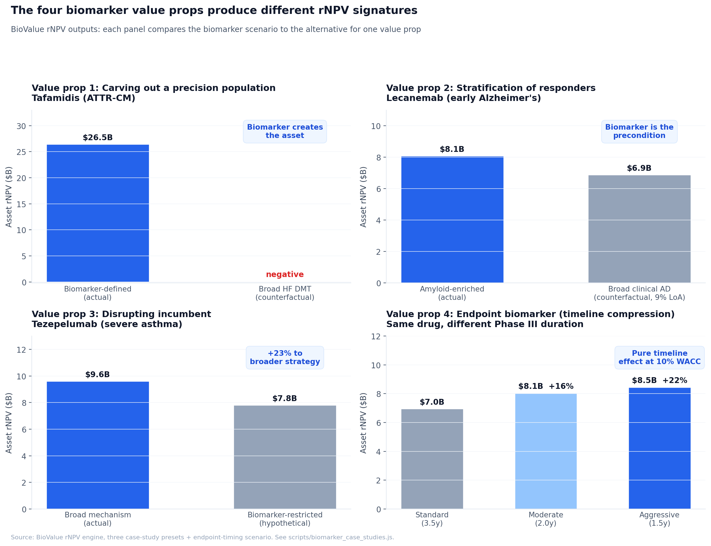

# Decomposing the biomarker premium

*The "+15–25% biomarker bump" survives because each underlying effect is real in some context. The aggregate rule fails because it doesn't condition on which.*

A lot of biotech valuation slides carry some version of "this asset uses a companion diagnostic, so we're applying a 20% PoS premium." Sometimes it's "+15pp," sometimes "+25%," sometimes a vaguer "precision medicine bonus." The number varies by firm and analyst. The intuition behind it does not. Biomarker-selected assets are widely believed to be worth more, almost regardless of which therapeutic area or what role the biomarker plays.

That intuition is right in some specific cases. It's flat wrong in others. The rule of thumb survives because, on average, it produces sensible-looking outputs even when the underlying mechanism is misidentified, and because most of the cases where it produces the wrong answer happen quietly without the analyst noticing. This post decomposes the "biomarker premium" into four distinct value props that biomarkers contribute in drug development and valuation, and shows what happens to Asset rNPV in each.

The four value props are not exclusive. A single drug program can deliver multiple biomarker value props, and the rNPV effects compound. The valuation analyst's job is to identify which apply and value each one against its own evidence base. The hand-wavy "+20% premium" is what you get when you don't do that work.

All four worked examples below are computed using [BioValue](https://github.com/...), an open-source rNPV tool. Inputs and outputs are reproducible by loading the corresponding case-study preset.

## The four biomarker value props

**Patient selection:**

1. **Carving out a precision population to target.** A biomarker identifies a molecularly-defined subpopulation within a broader indication. The subset enables orphan designation, premium pricing, smaller faster trials, and near-monopoly economics for several years. The smaller market is worth more per patient than the broader market would have been.

2. **Stratification of patient responders to capture target pathology.** The drug's mechanism applies only to a molecular subset of the clinically-diagnosed population. Without enrichment, the trial fails by signal dilution. With enrichment, the program is approvable. The biomarker is the precondition for the asset to exist, not a premium added to a viable broader version.

3. **Disrupting an incumbent biomarker-restricted market.** A class is dominated by drugs that require biomarker enrichment. A later-entrant with a broader mechanism removes the restriction, capturing patients the incumbents can't reach while also competing in the niche. The premium here flows to the broader-mechanism drug, not the biomarker-defined one.

**Endpoint measurement:**

4. **Accelerating development via surrogate endpoints.** A biomarker correlates with clinical benefit closely enough that regulators accept it as a surrogate endpoint. The Phase III trial reads out faster, accelerated approval becomes available, and time-to-launch compresses by 1–3 years. The acceleration shows up in Asset rNPV as a discount-rate effect, independent of TAM, peak, share, or PoS.

These produce different rNPV signatures. The "+20% rule" gets close to right in one of them and is wrong about the magnitude or sign in the others.

## Value prop 1: Tafamidis, the biomarker creates the asset

Heart failure is a clinically-defined indication treated by generics, valued at commodity pricing in a saturated market. ACE inhibitors, ARBs, beta blockers, MRAs, ICDs, and transplant collectively define the standard of care. The disease modifying claim for a new HF drug is, on a per-patient-revenue basis, almost economically uninteresting.

The 2019 ATTR-ACT trial established tafamidis as the first disease-modifying therapy for ATTR cardiomyopathy, a transthyretin amyloid pathology that turns out to underlie a substantial share of HF in older men. ATTR-CM is biomarker-defined: TTR amyloid deposition confirmed by scintigraphy or biopsy. The biomarker didn't just identify a responsive subpopulation. It carved out an under-diagnosed disease entity from generic HF, enabled orphan designation, supported premium pricing of ~$200K per year, and produced near-monopoly economics for five years before the first competitor (acoramidis) arrived.

Running both strategies through BioValue:

| Scenario | Peak (WW) | Launch prob | Asset rNPV | Comm-adj |
|---|---:|---:|---:|---:|
| **Tafamidis, ATTR-CM biomarker-defined** | $8.21B | 68.1% | **$26.46B** | $8.39B |
| Tafamidis, broad HF DMT (counterfactual) | $204M | 13.7% | *negative* | *negative* |

The "premium" isn't 20%. It is the difference between a $26B asset and a program that's net-negative even before considering opportunity cost. The mechanism (TTR stabilization) wouldn't work in unselected HF patients because most HF isn't TTR-driven. A hypothetical broad HF version of tafamidis isn't undervalued; it doesn't exist as a viable program.

This is the first of three patient-selection contexts where the +20% rule produces the wrong answer. In Value prop 1, the rule treats necessity as premium but in the opposite direction: the biomarker isn't a 20% bonus, it's the entire economic basis for the asset existing.

## Value prop 2: Lecanemab, the biomarker is the precondition, not the premium

For nearly two decades, anti-amyloid monoclonal antibodies for Alzheimer's failed Phase III. Bapineuzumab failed 2012. Solanezumab failed Phase III 2016, prevention trial 2020. Gantenerumab failed GRADUATE 1 and 2 in 2022. Crenezumab failed CREAD 2019. Five major failures in fifteen years, plus an entire BACE inhibitor class that wiped out simultaneously.

The defining methodological change that produced lecanemab and donanemab was requiring amyloid biomarker confirmation at enrollment. Clinical AD diagnosis is approximately 30% amyloid-negative in autopsy-confirmed series. An unenriched anti-amyloid trial enrolls a third of subjects who biologically cannot respond, and the trial's effect size drops by a third before any patient receives drug. Lecanemab's CLARITY-AD required amyloid PET or CSF Aβ42/40 confirmation. Donanemab's TRAILBLAZER-ALZ-2 required the same plus tau PET stratification. Both succeeded.

Running both strategies through BioValue:

| Scenario | Peak (WW) | Launch prob | Asset rNPV | Comm-adj |
|---|---:|---:|---:|---:|
| **Lecanemab, amyloid-enriched** | $4.31B | 51.0% | **$8.09B** | $2.77B |
| Lecanemab, broad clinical AD (counterfactual) | $20.64B | 9.1% | $6.88B | $2.33B |

The biomarker-enriched strategy produces only a +18% Asset rNPV premium on paper, which understates the case. Look at the columns. The broad-population counterfactual has a 5× larger peak ($20.64B vs $4.31B) because clinical AD is roughly 5× the size of biomarker-confirmed early AD. The reason its rNPV is *lower* is that launch probability crashes from 51% to 9.1%. The signal dilution from 30% amyloid-negative patients drops the Phase III success rate to historical anti-amyloid trial PoS levels (5–15%), and the cumulative LoA collapses.

The "+18% premium" framing misses what actually happened. The broad version isn't a viable alternative drug. It is a documented failure pattern repeated five times in fifteen years. The biomarker isn't a +20% premium added to a working program. It is the precondition for the program to be approvable at all. Valuing it as a premium on top of a fictional broader version radically understates the role the biomarker plays.

## Value prop 3: Tezepelumab, the broader strategy wins

Severe asthma had been carved into biomarker-defined segments by 2018. Anti-IgE (omalizumab, 2003) for IgE-high allergic asthma. Anti-IL-5 class (mepolizumab 2015, reslizumab 2016, benralizumab 2017) for eosinophil-high asthma. Anti-IL-4R (dupilumab, 2018 in asthma) for type 2 inflammation. Each had a biomarker requirement on its label.

The structural opportunity sitting underneath was the substantial fraction of severe asthma patients who didn't qualify for any of these drugs because their eosinophils were low or their inflammation wasn't type 2. AstraZeneca and Amgen's tezepelumab (anti-TSLP) addressed this by targeting an upstream alarmin that affects multiple downstream inflammatory pathways. NAVIGATOR Ph3 deliberately enrolled across all phenotypes, including eos-low. FDA approved tezepelumab in 2021 with no biomarker restriction. It is on track for $3B+ WW peak vs $1.5–2B for the entrenched anti-IL-5s.

Running both strategies through BioValue at Phase III entry economics:

| Scenario | Peak (WW) | Launch prob | Asset rNPV | Comm-adj |
|---|---:|---:|---:|---:|
| **Tezepelumab, broad mechanism** | $4.14B | 62.0% | **$9.61B** | $3.15B |
| Tezepelumab, biomarker-restricted (hypothetical) | $3.41B | 61.4% | $7.81B | $2.53B |

The broader-mechanism strategy produces a **+23% Asset rNPV premium** over the biomarker-restricted hypothetical, because the larger addressable population (eos-low + eos-high vs eos-high only) more than offsets the modest share advantage and price premium that biomarker enrichment would have bought in the smaller market.

The signal: in a market already segmented by biomarker, the +20% premium flows to whoever removes the dependency, not to whoever adds another biomarker-restricted entrant.

Stepping back across the three patient-selection value props: in Value prop 1, the rule treats necessity as premium but understates by an order of magnitude (the biomarker is the entire economic basis for the asset). In Value prop 2, the rule again treats necessity as premium and badly understates (the biomarker is the precondition for the program to be approvable). In Value prop 3, the rule misses sign entirely (the premium flows to the broader-mechanism drug, not to whoever adds another biomarker restriction). Three patient-selection contexts, three different ways the rule produces the wrong answer.

## Value prop 4: Endpoint biomarkers, where the "+20% rule" actually fits

The fourth value prop is different from the first three. A biomarker for patient selection affects who gets enrolled and how they respond. A biomarker for endpoint measurement affects how the trial reads out and how quickly it does so.

When a surrogate biomarker correlates with clinical benefit closely enough for regulatory acceptance, the Phase III trial reads out faster, accelerated approval becomes available, and time-to-launch compresses. LDL reduction for statins replaced years of CV outcomes wait. HbA1c for diabetes drugs replaced long-term complication endpoints. Tumor response rate (ORR) for oncology accelerated approval. Sustained virologic response at 12 weeks (SVR12) for HCV DAAs replaced multi-year liver outcome endpoints. Amyloid PET reduction for anti-amyloid AD accelerated approval, with clinical decline confirmatory.

How much compression is realistic depends on which surrogate is being used and whether the regulatory pathway accepts it:

- **Aggressive (2.0–2.5 years).** Oncology with ORR as the primary endpoint plus accelerated approval. Antivirals with viral-load endpoints. The compression here is real and has produced approvals years earlier than a clinical-endpoint trial would have. Pembrolizumab's first approval in 2014 was on Phase 1b ORR data, years ahead of OS-anchored confirmatory trials.
- **Moderate (1.0–1.5 years).** Specialty disease with a functional surrogate plus priority review. Ophthalmology Phase III with 6–12 month BCVA. CFTR modulators measuring FEV1 over 24 weeks. The compression comes from a shorter Phase III primary endpoint window plus priority review under Breakthrough Designation.
- **Modest (0.3–0.6 years).** Priority review only, no surrogate endpoint compression. Faster regulatory clock, same clinical trial duration.

Running an identical asset through BioValue at each compression level:

| Scenario | Peak | Launch prob | Asset rNPV | Premium vs standard |
|---|---:|---:|---:|---:|
| Standard Phase III (2.5y + NDA 1.0y) | $3.00B | 69.7% | $6.96B | baseline |
| Moderate acceleration (1.5y + NDA 0.5y) | $3.00B | 69.7% | $8.05B | **+16%** |
| Aggressive acceleration (1.0y + NDA 0.5y) | $3.00B | 69.7% | $8.45B | **+22%** |

Same drug. Same peak. Same launch probability. The Asset rNPV premium comes entirely from compression of time-to-launch at the discount rate. A 1.5-year compression produces +16%; a 2.0-year compression produces +22%. The conventional "+20% biomarker premium" lines up with the upper end, which corresponds to the most aggressive realistic scenario (oncology accelerated approval, antivirals with viral-load endpoints).

This is the source of the rule. Two-year compression at a 10% discount rate is mathematically about +21%, and there is reason to think the conventional analyst "+20% biomarker premium" originated as a heuristic for this specific scenario. The issue is that the rule got generalized beyond its original context. Applied to a typical specialty asset where realistic compression is 1.0–1.5 years, the rule overstates by 5–10 percentage points. Applied to a patient-selection biomarker case (Value props 1–3), the rule is doing something completely different from what its numerical magnitude implies.

The implication for analysts: when you see a "biomarker premium" being applied in a model, ask which value prop the biomarker is delivering and how aggressive the timeline compression assumption is. If it's an endpoint biomarker enabling oncology-style accelerated approval, the +20% rule has real economic content and is roughly right. If it's an endpoint biomarker enabling priority review without trial compression, +10% is closer. If it's a patient-selection biomarker, the rule is the wrong tool entirely.

## The four-role value props when valuing a drug asset

A working diagnostic for any biomarker-using asset:

1. **Is the biomarker for patient selection, endpoint measurement, or both?** Many assets do both. Trastuzumab uses HER2 for selection (Value prop 2-like) and for pharmacodynamic monitoring. Anti-amyloid AD drugs use amyloid for selection (Value prop 2) and amyloid PET reduction for accelerated approval (Value prop 4). Stack the effects rather than picking one.

2. **For patient-selection biomarkers, which of the three value props applies?**
   - Value prop 1 (precision population carve-out): the asset restricts to a biomarker-defined subset for orphan, pricing, or trial economics. Model the orphan premium, the pricing premium, the trial cost reduction, and the share advantage in the niche. The "+20% rule" is too coarse here; the biomarker may be the entire economic basis for the asset, or a defended-niche structural advantage worth far more than 20%.
   - Value prop 2 (stratification of responders): the asset adds a biomarker because the unenriched version doesn't work. Premium isn't 20%; it's the difference between viable and non-viable. Value the program assuming enrichment is mandatory.
   - Value prop 3 (disrupting incumbent): the asset removes a biomarker dependency. Premium flows to the broader strategy. Don't double-count by also applying a "biomarker bonus" to the incumbents.

3. **For endpoint biomarkers, quantify the timeline effect explicitly and check it against realistic compression for your context.** A 2-year compression at the discount rate is ~21%; 1.5 years is ~16%; 1 year is ~10%; 6 months is ~5%. The "+20% premium" assumes the upper-end scenario (oncology accelerated approval with ORR surrogate, or antiviral with viral-load surrogate), which is achievable but not universal. For specialty disease with priority review and functional surrogate, 1.0–1.5 years compression and a +10–16% uplift is more typical.

4. **Multiple value props compound, but don't aggregate them into a single premium.** A drug that uses a biomarker for both selection and endpoint (e.g., HER2 for trastuzumab selection plus HER2 expression dynamics as pharmacodynamic readout enabling faster Phase II decisions) gets the effects in sequence: TAM/PoS/price/share interactions from selection, plus timeline compression from endpoint. Compute each one against its own evidence base.

## Closing

The "biomarker premium" rule of thumb survives because each of its four underlying value props produces a real Asset rNPV uplift in some context. The aggregate rule doesn't survive scrutiny when you decompose what biomarkers actually do. Sometimes the biomarker is a defensible market carve-out with structural advantages that have nothing to do with PoS. Sometimes it is the precondition for the program to exist. Sometimes it is a disruption opportunity for someone else. Sometimes it is a timeline-acceleration mechanism that compresses development at the discount rate.

The valuation analyst who applies a flat "+20%" without identifying which of these is in play is using the right number for the wrong reasons. Sometimes they get the answer right anyway, because the rule is loosely calibrated and many programs combine multiple effects that partially offset. More often they badly undervalue Value prop 1 and Value prop 2 cases (treating necessity or structural carve-out as a 20% premium when the actual contribution is much larger), overvalue Value prop 3 cases (missing that the premium flows to the broader strategy), and correctly value Value prop 4 cases for reasons they don't articulate. Decomposing the premium is the only way to get to the right answer consistently.

---

*All four worked examples are computed using the [BioValue](https://github.com/...) rNPV engine. Case-study presets for tafamidis, lecanemab, and tezepelumab are included; the endpoint-biomarker comparison uses an Ophthalmology-TA Phase II asset with Phase III duration overrides. Every number in the tables above can be reproduced by loading the corresponding preset and reading the Deal Analysis tab, or by running `scripts/biomarker_case_studies.js` against the engine.*

---

## Footnotes

[^1]: The "30% amyloid-negative clinical AD" figure comes from autopsy-confirmed and amyloid PET-confirmed cohort studies. Specifically: Beach et al. 2012 (J Neuropathol Exp Neurol) found 28–35% of clinically-diagnosed AD patients were amyloid-negative at autopsy depending on subtype. Klunk et al. 2004 and subsequent PIB PET studies confirmed similar rates in vivo.

[^2]: Wong, Siah, Lo (2019) explicitly caution that biomarker sample sizes outside oncology are too small for confident PoS comparisons. Their oncology biomarker sample (1,136 Phase 1→2 transitions) supports the standard "biomarker improves PoS in oncology" finding (10.7% vs 1.6% overall PoS, ~6.7× improvement). Non-oncology biomarker samples are 5–42 transitions per phase per TA, which is too few to interpret. The ALPHA TA-aggregate biomarker columns shown in BioValue carry the same caveat.

[^3]: The accelerated approval pathway (21 CFR 314 Subpart H for drugs, 21 CFR 601 Subpart E for biologics) allows FDA approval based on a surrogate endpoint that is reasonably likely to predict clinical benefit, with a confirmatory post-marketing trial required. The pathway is used heavily in oncology (~75% of FDA novel oncology approvals 2015–2023) and increasingly in CNS, rare disease, and infectious disease.

[^4]: Tafamidis 2024 WW sales of ~$5.5B from Pfizer reporting; ICER 2024 ATTR-CM economic review. Net of acoramidis (BridgeBio) and vutrisiran (Alnylam) entries 2024, peak tafamidis is reverting from monopoly to oligopoly economics.

## Sources

1. **MIT Project ALPHA database.** Clinical development success rates, biomarker-stratified by therapeutic area. https://projectalpha.mit.edu/pos/
2. **Wong CH, Siah KW, Lo AW.** "Estimation of clinical trial success rates and related parameters." *Biostatistics* 2019, 20(2): 273–286.
3. **NAVIGATOR Phase 3 trial (tezepelumab).** Menzies-Gow et al., *NEJM* 2021, 384(19): 1800–1809.
4. **CLARITY-AD trial (lecanemab).** van Dyck et al., *NEJM* 2023, 388(1): 9–21.
5. **TRAILBLAZER-ALZ 2 trial (donanemab).** Sims et al., *JAMA* 2023, 330(6): 512–527.
6. **ATTR-ACT trial (tafamidis).** Maurer et al., *NEJM* 2018, 379(11): 1007–1016.
7. **FDA companion diagnostic device list.** https://www.fda.gov/medical-devices/in-vitro-diagnostics/list-cleared-or-approved-companion-diagnostic-devices-in-vitro-and-imaging-tools
8. **ICER ATTR-CM economic review 2024.** https://icer.org/assessment/transthyretin-amyloid-cardiomyopathy-2024/
9. **Beach TG et al.** "Accuracy of the clinical diagnosis of Alzheimer disease at National Institute on Aging Alzheimer Disease Centers, 2005-2010." *J Neuropathol Exp Neurol* 2012, 71(4): 266–273.

## Glossary

- **Asset rNPV.** Risk-adjusted Net Present Value of an asset's standalone cash flows at the acquirer's WACC, with full peak revenue and full cumulative launch probability.
- **Accelerated approval.** FDA regulatory pathway permitting approval based on surrogate endpoints reasonably likely to predict clinical benefit, with confirmatory trial required.
- **ARIA.** Amyloid-Related Imaging Abnormalities. Anti-amyloid therapy class effect requiring MRI monitoring and ApoE4-status-based risk stratification.
- **ATTR-CM.** Transthyretin amyloid cardiomyopathy. Biomarker-defined molecular subset of heart failure.
- **Biomarker (in clinical development).** A measurable indicator used for one or more of: patient selection at trial enrollment, target engagement / pharmacodynamic monitoring, surrogate endpoint, or response prediction.
- **Companion diagnostic (CDx).** Regulated in vitro diagnostic test paired with a specific drug, used to identify patients eligible for the drug.
- **eos / eosinophil count.** Blood eosinophil concentration, expressed as cells/μL. Used to enrich severe asthma trials for type 2 inflammation.
- **LoA.** Likelihood of Approval. Cumulative probability of reaching commercial launch from a given development stage.
- **PoS.** Probability of Success. The transition probability from one development phase to the next.
- **rNPV.** Risk-adjusted NPV. Standard NPV with each cash flow multiplied by the cumulative probability of reaching that stage.
- **Surrogate endpoint.** A biomarker that substitutes for a direct measure of clinical benefit, used to support regulatory approval.
- **TAM.** Total Addressable Market. The patient pool a drug can reach given its label, mechanism, and competitive position.
- **TSLP.** Thymic Stromal Lymphopoietin. An upstream epithelial-cell alarmin that activates multiple downstream inflammatory pathways. Tezepelumab target.
- **WACC.** Weighted Average Cost of Capital. The discount rate applied to risk-adjusted cash flows.
