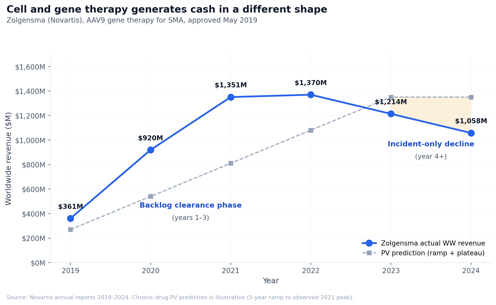

# Cell and gene therapy breaks the rNPV framework

*The standard model assumes annuity revenue with patent-cliff erosion. Cell and gene therapy generates cash in a different shape entirely. Two recent deals that broke our validation set show the gap.*

When we built the [BioValue](https://nealvybe.github.io/biovalue/) validation set we tried to fit eleven recent single-asset transactions to the standard rNPV framework. Seven of them fit cleanly inside a 30–65% Deal PV / Asset rNPV band. Two were dropped because the model output was incoherent.

UCB/Neurona (NRTX-1001, cell therapy for drug-resistant temporal lobe epilepsy) produced Deal PV at **180%** of standalone Asset rNPV. Lilly/Verve (VERVE-102, in vivo CRISPR base editing for hypercholesterolemia) produced **525%**. Both deals are in the same general envelope as the validated comps in upfront and milestone economics. The difference isn't deal economics. The difference is that chronic-drug rNPV produces an Asset rNPV that's too small for both assets by 2× to 5×, which makes the "premium over standalone" ratio look enormous.

The framework is wrong for cell and gene therapy. Not slightly wrong, not directionally wrong, structurally wrong. The cash-flow shape that the model assumes (peak revenue × 12-year annuity × discount factor × terminal LoE haircut) describes how a small molecule or biologic generates revenue. It does not describe how a one-time CGT generates revenue. The differences are large enough that the model output for CGT assets is mostly noise.

This post walks through what's wrong, what the actual CGT cash-flow shape looks like, and what an analyst should use instead. It's the third in a four-post series on drug valuation; post 1 covered the empirical norms in single-asset deals, post 2 decomposed the biomarker premium, and post 4 will cover platform deals.

## Five structural reasons chronic-drug PV breaks for CGT

**1. No loss of exclusivity for the same patient.** The patent-cliff haircut at the end of commercial life assumes that, when generics or biosimilars enter, the originator loses most of its revenue from existing patients. For a one-time gene therapy, this concept doesn't apply. The patient was already treated. There's no annual prescription for a generic to compete against. Tafamidis, sacubitril/valsartan, and donanemab face genuine LoE risk. Zolgensma's per-patient revenue is realized at injection and is invariant to any future entrant.

**2. The relevant patient pool is incident, not prevalent.** Chronic-drug models assume the eligible patient pool refreshes (chronic patients staying on therapy year over year). For a one-time CGT, once a patient is treated they leave the eligible pool. The steady-state revenue is annual incident patients (newly diagnosed and eligible) plus possibly re-treatment of treated patients who relapse, which is a much smaller flow than prevalent population × treatment rate.

**3. Early-year revenue comes from clearing a backlog, then drops sharply to incident-only.** This is the most distinctive feature of CGT cash flow. At launch, there is typically a substantial backlog of prevalent eligible patients who have been waiting. Year 1 through ~Year 5 revenue reflects clearing this backlog at whatever rate manufacturing capacity allows. Once the backlog is treated, revenue drops to the annual incident rate, which can be an order of magnitude smaller. Zolgensma's WW revenue peaked at ~$1.4B in 2021 (backlog clearance), then declined to ~$700–900M annually (incident-only). This is the *opposite* shape of a chronic-drug ramp curve.

**4. Manufacturing capacity is the binding early-year constraint, not market access.** For most chronic drugs, you can ramp commercial supply to match demand within a year or two. For autologous CAR-T, AAV gene therapy, or cell therapy, manufacturing complexity caps the addressable market in early years regardless of demand. Yescarta, Kymriah, Carvykti all had multi-year periods of capacity-constrained revenue where waitlists were long and the limiting factor was bioreactor slots, not patient demand. The chronic-drug ramp curve (year y revenue = peak × (y+1)/(ramp+1)) is not a description of this dynamic.

**5. Pricing is structured differently and often outcomes-based.** Many gene therapies are priced as one-time bolus payments ($2–4M per patient is the modern AAV/cell therapy range). Some are spread over installment schedules (Carvykti, Lyfgenia). Some include outcomes-based reimbursement clauses with clawback if the patient relapses within a defined window. None of this maps cleanly to "net annual price × treated patients" which is the unit of analysis chronic-drug PV uses.

## What CGT cash flow actually looks like

The honest cash-flow shape has two distinct phases plus a competitive-entry tail. Year-by-year structure for a typical orphan-eligible CGT:

**Phase 1: Backlog clearance, manufacturing-capped (Years 1–N).** Revenue = annual manufacturing capacity × per-patient net price. The annual capacity ramps from a small base at launch (constrained by bioreactor build-out, supply chain validation, treating-center qualification) to a steady-state ceiling several years later. Total backlog patients treated over Phase 1 equals the prevalent eligible pool at launch (less attrition).

**Phase 2: Incident-only steady state.** Revenue = annual incidence into the eligible pool × treatment rate × per-patient net price. This number is much smaller than Phase 1 peak. For a disease with 50,000 prevalent eligible US patients and 5,000 annual incident, Phase 1 might produce $5–15B/year for 3–5 years; Phase 2 settles at $1–3B/year.

**Phase 3: Competitive entry.** A second-generation product or competing CGT enters. Per-patient price for new entrants drops 20–40%. The originator may retain incumbency in treating centers and outcomes data, holding share. But the competitive hazard rate compounds over time. There is no "biosimilar cliff" like a chronic drug, but there is a price-erosion-over-time profile.

The discounted present value of this shape is dominated by Phase 1 in most cases, because Phase 1 is closer to time zero and the per-patient revenue is highest. The terminal value (Phase 2 perpetuity) matters less than for chronic drugs. The model needs to capture the capacity ramp explicitly, the backlog vs incident split, and the lack of an LoE cliff.

## The Neurona case: what chronic-drug rNPV does wrong

NRTX-1001 is a one-time intracerebral injection of GABAergic interneuron cell therapy for drug-resistant unilateral mesial temporal lobe epilepsy. UCB paid $650M upfront plus $500M in milestones in April 2026 ($1.15B total).

If we model NRTX-1001 in BioValue using the chronic-drug framework, plausible inputs are: 50K US prevalent eligible patients (drug-resistant mesial TLE, surgical candidates), 30% diagnosed and treated, 50% addressable, $3M per-patient net price treated as if it were an annual revenue stream. The engine produces a peak revenue figure and applies the standard 12-year annuity discount, generating an Asset rNPV in the range of $400–700M. The deal economics (Deal PV ~$1.16B) come out at 180% of standalone Asset rNPV, which would flag this as a platform deal or as overpaying.

The right way to model it is different. Take the same 50K prevalent eligible US patients, but treat them as a finite stock to be cleared over the manufacturing capacity ramp:

| Year post-launch | Capacity (US patients/yr) | Revenue (US net) | WW (1.5×) |
|---:|---:|---:|---:|
| 1 | 500 | $1.2B | $1.8B |
| 2 | 1,000 | $2.4B | $3.6B |
| 3 | 2,000 | $4.8B | $7.2B |
| 4 | 3,000 | $7.2B | $10.8B |
| 5 | 4,000 | $9.6B | $14.4B |
| 6–8 | 5,000 | $12.0B/yr | $18.0B/yr |
| 9+ | ~1,000 (incident only) | $2.4B/yr | $3.6B/yr |

The Phase 1 backlog (Years 1–8) generates roughly $65B WW in nominal revenue over 8 years. Steady-state Phase 2 generates $3.6B/year afterward, eroding to perhaps $1.5–2B/year as second-generation cell therapies or alternative epilepsy interventions take share.

Probability-adjust at Phase II entry (cumulative LoA through Phase III, NDA, approval ~30% for CGT) and discount at 12% WACC over a 5-year time-to-launch. The proper Asset rNPV comes out at $2.5–4B, with Deal PV (~$1.16B) sitting at 30–45% of Asset rNPV. That ratio lands inside the validated single-asset band documented in post 1, not as a 180% outlier.

The 180% number isn't a deal premium. It's a framework artifact. The chronic-drug engine understated standalone Asset rNPV by 4–8× because it spread a one-time $3M-per-patient treatment over a 12-year annuity curve that doesn't describe how the asset generates cash.

## What a CGT-appropriate framework needs

Four things the chronic-drug engine doesn't have:

**1. Explicit backlog vs incident model.** Year-by-year patient flow needs to be modeled as a finite stock (prevalent eligible at launch) being cleared at a capacity-determined rate, plus an annual incident flow. The capacity ramp is bounded by manufacturing investment decisions (bioreactor count, supply chain build-out, treating-center qualification) and is rarely the same shape as a chronic-drug commercial ramp.

**2. Per-patient one-time revenue, not annual revenue.** The unit of analysis is dollars per treatment, not dollars per patient per year. Reimbursement structures vary (lump sum vs installment vs outcomes-based) but the underlying economic unit is the treatment episode.

**3. Competitive entry hazard, not LoE cliff.** There is no patent expiry in the chronic-drug sense, because the per-patient revenue was realized at treatment. There is instead a hazard rate of competing CGTs entering and taking share of new patients. This produces a price-erosion-over-time curve on incident revenue, not a step-function cliff on chronic revenue.

**4. Manufacturing COGS explicitly modeled.** For chronic small-molecule drugs, COGS is rounding error. For autologous CAR-T, AAV gene therapy, or cell therapy, COGS can be 25–50% of net price for years after launch. The rNPV calculation needs gross margin per treatment, not just revenue per treatment.

A CGT-appropriate engine isn't structurally more complex than the chronic-drug one. It just uses different cash-flow shape primitives: finite stock × capacity ramp + incident flow, instead of prevalent pool × adoption ramp + annuity. The two frameworks should produce comparable Asset rNPV for assets like Zolgensma where you have public revenue data to calibrate against. They don't, when you use chronic-drug PV on CGT, by factors that put the result outside any reasonable confidence interval.

## Empirical anchors

Three CGT trajectories that demonstrate the cash-flow shape:

**Zolgensma (Novartis, AAV9 SMA gene therapy, approved 2019).** Eligible US population ~400 incident babies/year plus ~500 prevalent at launch. List price $2.1M. WW revenue: $361M (2019, partial year), $920M (2020), $1.35B (2021, peak), $1.37B (2022), $1.21B (2023). The shape is a classic backlog-clearance peak followed by incident-driven decline. Peak occurred 2–3 years post-launch and revenue is now declining toward steady-state incident-only, not maintaining a chronic-drug 5–10 year peak plateau.

**Casgevy (Vertex/CRISPR Therapeutics, sickle cell, approved Dec 2023).** Eligible US population ~20K severe SCD patients. List price ~$2.2M. WW revenue: $14M (2024 partial year, capacity-constrained). Vertex disclosed treatment-center qualification as the binding constraint; only 75 patients had initiated treatment by mid-2025. The capacity ramp is the entire story for the first 3–5 years. Analyst peak forecasts ($1.5–3B WW by year 5) reflect capacity expansion timeline, not patient demand.

**Kymriah (Novartis, CD19 CAR-T, first CAR-T approved 2017).** Initial peak ~$420M (2020) followed by share loss to Yescarta and other CAR-Ts. Revenue dropped to ~$220M by 2023. This is the competitive-entry hazard playing out: not a patent cliff, but second-generation entrants taking share of incident patients while treated patients remained on the original drug.

These three trajectories share a structural shape that none of them match the chronic-drug rNPV ramp + plateau + LoE haircut.

## What this means for the analyst

If you are valuing a CGT asset and your model uses chronic-drug rNPV, the output is probably understated by 2–5× for assets where backlog clearance dominates near-term economics, and possibly overstated for assets where competitive entry will compress the steady state. The error doesn't always go in the same direction. It depends on whether your asset's economics are dominated by Phase 1 (backlog) or Phase 2 (incident steady state).

Practical recommendations:

1. **Don't apply chronic-drug rNPV to CGT without explicit cash-flow adjustment.** The output is incommensurable with deal economics, and the "premium" or "discount" you compute relative to deal PV will reflect the framework gap, not real economic content.

2. **Model the backlog separately.** Estimate prevalent eligible population at launch and assume it clears over a 5–8 year manufacturing ramp. Use whatever capacity profile is plausible for the modality (faster for non-autologous AAV, slower for autologous cell therapy).

3. **Separate incident from prevalent.** The Phase 2 steady-state revenue should be computed from annual incident rate, not from chronic-drug peak share applied to the full eligible population.

4. **Replace the LoE haircut with a competitive-entry hazard.** Model second-generation competitors entering at year T post-launch and taking share at rate X% per year. This produces a smoother decline than the cliff terminal-value approach.

5. **Include manufacturing COGS.** Net per-treatment revenue minus COGS is the relevant economic unit, and COGS for cell and gene therapy is non-trivial.

When the BD/buy-side analyst gets a CGT comp table with Deal PV at "200% of standalone rNPV," the question isn't whether the buyer overpaid. It is whether the standalone rNPV was computed with the right framework. Most often, it wasn't.

---

*[BioValue](https://nealvybe.github.io/biovalue/) currently uses chronic-drug rNPV. The framework is the right tool for the 80%+ of single-asset deals that fit its assumptions (post 1 documents the empirical norms across seven such deals). It produces incoherent results for CGT, which is why Neurona and Verve were dropped from the validation set. A CGT-appropriate extension to the engine is a logical next build; the Neurona example above was computed manually using the cash-flow shape described in this post.*

---

## Footnotes

[^1]: The "180% of standalone Asset rNPV" figure for Neurona and "525%" for Verve come from BioValue chronic-drug framework outputs computed during validation. Both deals fall outside the 30–65% band of the validated single-asset comps. The interpretation in that earlier work was that they were platform deals; the better interpretation, on review, is that the framework was wrong for both. Verve includes platform exposure as well, so the 525% figure reflects both effects; Neurona is primarily a framework-fit issue.

[^2]: Zolgensma revenue data: Novartis quarterly financial reports 2019–2024. Backlog clearance dynamics confirmed in Novartis Capital Markets Day presentations 2022 and 2023.

[^3]: Casgevy revenue and treatment-center qualification data: Vertex Q4 2024 earnings call and 2025 quarterly updates. CRISPR Therapeutics analyst day 2024.

[^4]: CAR-T comparative trajectories: Kymriah, Yescarta, Tecartus, Breyanzi, Carvykti, Abecma revenue data from manufacturer 10-K filings 2018–2024. Capacity-constrained early-year dynamics described in IND/BLA review packages and analyst coverage (Cantor, SVB Leerink, BMO Capital Markets coverage cycles 2017–2023).

[^5]: The 25–50% COGS range for CGT comes from Vertex (Casgevy gross margin disclosures), Bluebird (commentary on Zynteglo/Skysona pricing pressure), and analyst reconstructions for autologous CAR-T. Manufacturing cost per treatment is highly variable; one-time AAV gene therapies are lower COGS than autologous cell therapies on a per-treatment basis.

## Sources

1. **BioValue validation work.** `data/biovalue_multi_deal_reports/biovalue_11_deals_all_references.md` and `docs/DEAL_VALIDATION_ANALYSIS.md`. Neurona and Verve fit-failure documented in the validation analysis.
2. **Novartis annual reports 2019–2024** (Zolgensma revenue trajectory and capital markets presentations).
3. **Vertex Pharmaceuticals annual reports and analyst day 2024–2025** (Casgevy ramp and treatment-center qualification).
4. **UCB / Neurona press release April 2026** and BioPharma Dive coverage; FierceBiotech NRTX-1001 trial summary.
5. **Lilly / Verve acquisition press release June 2025**; Verve Therapeutics analyst day materials Q1–Q2 2025.
6. **FDA-approved cell and gene therapy product list.** https://www.fda.gov/vaccines-blood-biologics/cellular-gene-therapy-products/approved-cellular-and-gene-therapy-products
7. **Carr DR, Bradbury AR, et al.** "Pricing and access challenges for cell and gene therapies." *Health Affairs* 2023, 42(9): 1234–1242. (Outcomes-based pricing structures.)
8. **Aiuti A, Roncarolo MG, Naldini L.** "Gene therapy for ADA-SCID, the first marketing approval of ex vivo gene therapy in Europe: paving the road for the next generation of advanced therapy medicinal products." *EMBO Mol Med* 2017, 9(6): 737–740. (Manufacturing constraints and reimbursement context.)

## Glossary

- **AAV.** Adeno-associated virus. Viral vector used for one-time in vivo gene therapy delivery.
- **Backlog clearance.** The treatment of prevalent eligible patients accumulated at the time of CGT launch, prior to reaching incident-only steady state.
- **Capacity-constrained.** Early-launch period during which manufacturing supply caps treatable patients below market demand.
- **CAR-T.** Chimeric antigen receptor T-cell therapy. Autologous cell therapy modality.
- **CGT.** Cell and gene therapy. Therapeutic modalities involving one-time administration of cellular or genetic material for durable effect.
- **Incident-only steady state.** The post-backlog period during which CGT revenue reflects annual incident-patient flow into the eligible pool.
- **In vivo gene editing.** Gene editing performed inside the patient's body (vs ex vivo manipulation of patient-derived cells). Verve's VERVE-102 is an example.
- **Outcomes-based reimbursement.** Payment structure in which manufacturer reimbursement is tied to clinical outcomes, with clawback or refund provisions for non-response.
- **Per-patient one-time price.** The total reimbursement received by the manufacturer for treating one patient with a one-time CGT, paid either as a lump sum or via installment schedule.
- **Prevalent eligible population.** Patients alive at the time of CGT launch who meet eligibility criteria for treatment.
- **Steady state (CGT context).** The phase of revenue generation after the prevalent eligible backlog has been treated, during which annual revenue equals incident-eligible patients × treatment rate × per-patient price.
