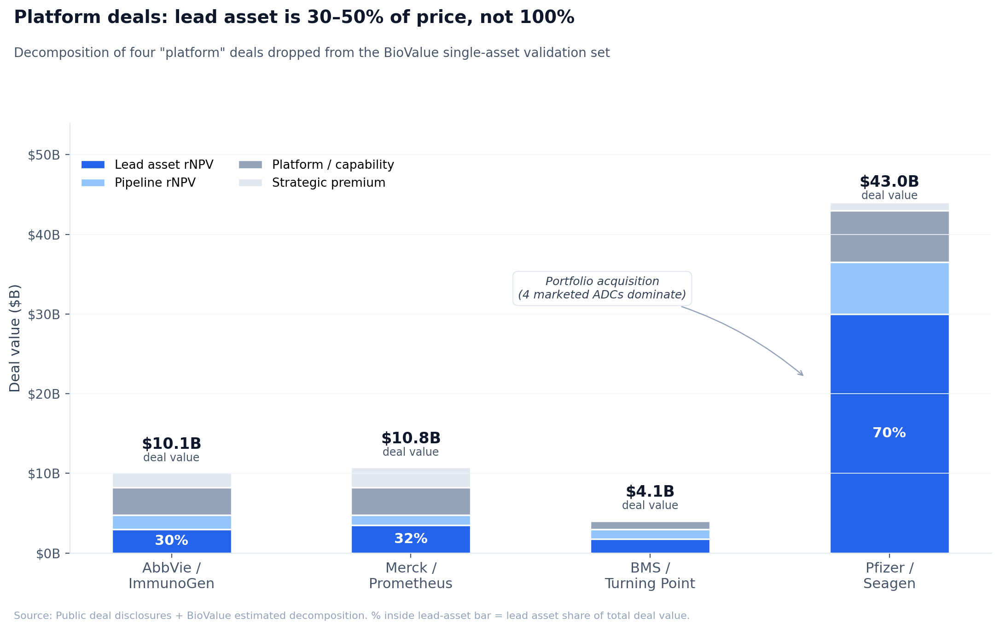

# When the deal isn't a single asset

*"The market is paying 3–5× rNPV for biotech assets" is a common conclusion from deal comp tables. It's wrong because most of those comps aren't single-asset deals. Telling them apart is the analyst's first job on any new transaction.*

This is the fourth and final post in the series on drug asset valuation. Posts 1 and 2 covered analytical clarity within the standard single-asset rNPV framework: how Deal PV / Asset rNPV ratios cluster in a tight band across well-defined single-asset deals (post 1), and how the "biomarker premium" decomposes into four distinct value props (post 2). Post 3 covered the cash-flow shape problem in cell and gene therapy, where the standard rNPV framework produces Asset rNPVs that are wrong by 2–5×. Post 4 covers the other major framework failure: deals that aren't really single-asset deals at all, where the lead asset's standalone rNPV explains only a fraction of the deal price.

The empirical anchor for this post is the same validation work that produced post 1. We started with eleven recent transacted deals and ran each through the [BioValue](https://nealvybe.github.io/biovalue/) rNPV engine. Seven fit cleanly inside a 30–65% Deal PV / Asset rNPV band, and post 1 documented their empirical norms. Four of the eleven produced Deal PV / Asset rNPV ratios of 200–500%, and were dropped from the validation set. Those four are the platform deals. The 200–500% multiples weren't the market overpaying. They were the analyst applying single-asset rNPV to deals where the lead asset captures only a fraction of the value transacted.

## Why the trade press conflates them

Deal headlines are written about deal size, not deal content. "AbbVie pays $10.1B for ImmunoGen (Nov 2023)" and "Sobi pays $950M for Arthrosi (Dec 2025)" both file under "Phase III oncology / specialty M&A" in the standard comp table. The analyst who reads them as comparable single-asset transactions inherits an apples-to-oranges comparison that nothing in the public framing flags. The single-asset Sobi/Arthrosi deal closed at ~84% of standalone Asset rNPV. The AbbVie/ImmunoGen deal closed at ~400%. The analyst concludes "the market is paying anywhere from 0.8× to 4× rNPV depending on the deal, which is hard to model." The honest version is that one of them is a single-asset deal and the other one isn't.

The press has structural reasons to flatten this distinction. Buy-side coverage rewards size, not analytical content. The acquirer's investor relations function frames every deal as strategic with synergies. The seller's outgoing management has reasons to claim full credit for the price. Nowhere in the standard deal disclosure does anyone explicitly attribute price across the lead asset, the broader pipeline, the manufacturing organization, and the scientific capability. The analyst has to do that decomposition unaided.

## Diagnostic signals for platform vs single-asset

Five signals separate platform from single-asset transactions. None is conclusive on its own. In combination, they're reliable.

**1. Lead asset's share of total deal value.** A clean single-asset deal has the lead asset accounting for 80–95% of the price. The seller may have a follow-on or two in earlier stages, but the lead is the economic justification. A platform deal has the lead asset at 30–60% of the price, with the balance attributable to pipeline, manufacturing, and capability. If the back-of-envelope standalone Asset rNPV of the lead asset is less than half the deal price, the question shifts from "is this a strategic premium?" to "what else is in the deal?"

**2. Pipeline breadth at acquisition.** A single-asset seller has one lead, one or two preclinical follow-ons, and a small team. A platform seller has 5–30+ programs across multiple stages, often with related mechanism-of-action or modality clustering (an ADC platform with five ADC programs; a TL1A platform with one approved IBD asset plus a CRC follow-on plus a rheumatology Phase 1). Pipeline breadth above ~5 programs is a strong platform signal.

**3. Whether the acquirer retains the scientific staff.** Single-asset deals routinely shed most of the seller's R&D headcount; the buyer integrates the asset into existing organizations. Platform deals retain scientific staff because the platform IS the people. ImmunoGen's medicinal chemistry, linker design, and ADC bioconjugation expertise transferred to AbbVie. CRISPR Therapeutics' gene-editing team transferred to Vertex via partnership rather than acquisition specifically because the expertise was the asset.

**4. Whether the acquirer retains the manufacturing organization.** Single-asset deals frequently transfer manufacturing to the acquirer's existing CMC infrastructure. Platform deals retain the seller's manufacturing because the manufacturing IS the platform. ADC drug-substance/drug-product capability, autologous cell therapy manufacturing, AAV vector production are all hard to replicate; acquirers pay for the operational asset rather than build their own.

**5. The deal narrative in the press release.** Single-asset deal language emphasizes the lead drug: "we are acquiring X to address [specific patient population] in [therapeutic area]." Platform deal language emphasizes capability: "we are adding leading ADC technology to our oncology pipeline" or "this transaction strengthens our position in [modality]." The narrative isn't dispositive, but it's a strong tell. The acquirer is rarely shy about explaining what they thought they were buying.

## Worked examples: the four platform deals from the validation set

The four deals that broke the single-asset framework, decomposed:

### AbbVie / ImmunoGen ($10.1B, Nov 2023)

Lead asset: Elahere (mirvetuximab soravtansine, IMGN853), a folate receptor α (FRα) targeted ADC. Phase III, accelerated approval in platinum-resistant ovarian cancer Nov 2022, full approval Mar 2024. Peak forecasts in the $1.5–2B WW range at the time of the deal.

Single-asset standalone rNPV of Elahere at deal close, computed with standard rNPV using public peak forecasts and Phase III stage probability adjustments: approximately **$2.5–3.5B**. Even at the high end, the lead asset explains roughly 30–35% of the $10.1B deal price.

What else was in the deal:
- **IMGN632 (CD123 ADC):** Phase I/II in BPDCN and AML, several hundred million dollars of pipeline NPV.
- **Pivekimab sunirine and other FRα follow-ons:** clinical-stage ADCs targeting different settings.
- **ADC platform technology:** linker chemistry, payload optimization, bioconjugation know-how. AbbVie subsequently used ImmunoGen's ADC capability to anchor its broader ADC strategy.
- **Manufacturing organization:** ADC drug substance and drug product capability, which is operationally complex and expensive to build.
- **Strategic premium:** competitive bidding context; AbbVie was rebuilding oncology and ADCs were the strategic priority.

Plausible decomposition: $2.5–3.5B lead asset + $1.5–2B pipeline + $3–4B platform/manufacturing + $1.5–2B strategic premium ≈ $9.5–11.5B reconciled. The deal isn't a 4× single-asset multiple. It's a roughly fair price for what was actually transacted, which wasn't a single asset.

### Merck / Prometheus ($10.8B, Apr 2023)

Lead asset: PRA023 (now MK-7240), a TL1A monoclonal antibody for IBD (UC and Crohn's). Phase II at acquisition, with Phase III initiated post-acquisition.

Single-asset standalone rNPV of PRA023 at Phase II for IBD, with TL1A representing a novel mechanism and substantial peak forecasts ($3–5B WW): approximately **$3–4B**. The lead asset explains roughly 30–40% of the $10.8B price.

What else was in the deal:
- **Earlier-stage immunology pipeline:** TL1A in additional indications, plus other mechanisms.
- **TL1A platform:** Prometheus had built the TL1A clinical and translational program over a decade; the diagnostic and biomarker work supporting TL1A patient stratification was core IP.
- **Immunology positioning:** Merck explicitly framed the deal as anchoring its re-entry into immunology, where Keytruda's eventual LoE creates a 2028+ revenue gap to fill.
- **Strategic premium:** TL1A was widely viewed as the most-validated novel IBD mechanism at the time; competitive auction included multiple major bidders.

Plausible decomposition: $3–4B lead asset + $1–1.5B pipeline + $3–4B platform/strategic positioning + $2–3B competitive premium ≈ $9–12.5B reconciled.

### BMS / Turning Point ($4.1B, Jun 2022)

Lead asset: repotrectinib, a ROS1/NTRK TKI. Phase III at acquisition, approved Nov 2023 as Augtyro.

Single-asset standalone rNPV of repotrectinib at Phase III in ROS1+ NSCLC (a small, biomarker-defined oncology indication) plus NTRK follow-on: approximately **$1.5–2B**. The lead asset explains roughly 40–50% of the $4.1B price.

What else was in the deal:
- **Taletrectinib (TPX-0131):** Next-generation ROS1 inhibitor in clinical development.
- **Elzovantinib (TPX-0022) and TPX-0046:** MET/SRC and RET-targeted TKIs.
- **TKI platform:** Turning Point had a distinctive medicinal chemistry capability for resistance-breaking TKI design, particularly for kinases with frequent mutations.
- **Strategic positioning:** BMS was building precision oncology capability; the TKI pipeline matched their existing portfolio gaps.

Plausible decomposition: $1.5–2B lead asset + $1–1.5B pipeline + $0.8–1.2B platform + $0.3–0.6B strategic premium ≈ $3.6–5.3B reconciled.

### Pfizer / Seagen ($43B, Mar 2023)

This one is a different category. Seagen had four commercial ADCs at the time of acquisition (Adcetris, Padcev, Tukysa, Tivdak) generating ~$5B in combined revenue and growing. The deal is best understood as a portfolio acquisition rather than a single-asset-plus-platform deal. The standard single-asset framework breaks here not because the lead asset is too small a share of the price, but because there is no single lead asset.

Quick decomposition: four marketed ADCs at NPV of $25–35B + pipeline (multiple late-stage ADCs including disitamab vedotin) at $5–8B + ADC platform and manufacturing capability at $5–10B + strategic premium $2–5B ≈ $37–58B reconciled vs $43B deal.

The Pfizer/Seagen deal is the right example to keep separate from the other three. It's not the "lead asset captures 30% of value" pattern. It's the "this is a portfolio, not a deal" pattern. The analyst should recognize portfolio acquisitions immediately (multiple commercial revenue streams; long pipeline; significant manufacturing) and apply different valuation entirely (sum-of-parts on the marketed assets, real options on the platform).

## Why running single-asset rNPV on platform deals produces the "irrational market" framing

When the analyst takes the standard 30–65% Deal PV / Asset rNPV band (from post 1) and tries to extend it to AbbVie/ImmunoGen, the deal price exceeds standalone Asset rNPV by 3–4×. If you don't decompose, the only explanations available are "market is paying massive strategic premia" or "the rNPV framework is wrong." Both feel unsatisfying. The first reads as a hand-wave; the second undermines the framework's utility.

The decomposition explanation is more useful. The deal price is reconciled when you separately value the lead asset (standalone rNPV), the pipeline (rNPV per program with stage-appropriate discount), the platform (real options or capability-replacement-cost), and any strategic premium. Each component has its own evidence base. The aggregate is what the acquirer actually paid for. There is no "irrational market" or "framework breakdown"; there are four components being summed instead of one.

Most BD analyst reports don't do this decomposition explicitly. They either (a) include platform deals in single-asset comp tables and produce a wide dispersion that they then explain as "market noise," or (b) exclude platform deals as outliers without articulating the methodological reason. Neither approach scales to the next deal that comes across the desk.

## What to use instead: a platform valuation framework

Four components, valued separately and summed.

**1. Lead asset rNPV.** Use the standard rNPV framework (or CGT-appropriate framework per post 3 if applicable). For a platform deal, this typically explains 30–50% of the price. Documented confidence intervals here are the same as for any single-asset deal.

**2. Pipeline rNPV.** For each program in clinical development, compute Asset rNPV at the appropriate stage with stage-specific PoS. Sum across programs, often with a correlation discount (10–20%) because programs in the same platform share scientific risk, regulatory pathway, and commercial-execution risk.

**3. Platform / capability value.** This is the harder piece and where most of the rigor gets sloppy. Three honest approaches:

   - **Real options on future programs.** Estimate the rate at which the platform produces development candidates, the stage-specific PoS for those candidates, and the expected NPV per program. Discount appropriately. This is real options framing rather than DCF; it captures the value of having the capability available even when specific programs aren't yet identified.
   - **Replacement cost.** Estimate what it would cost the acquirer to build the equivalent platform from scratch: scientific staff, manufacturing, IP licenses, time. ADC manufacturing capability has been replicated by acquirers at costs in the $1–3B range and 3–5 year timelines. CAR-T autologous manufacturing similar.
   - **Pipeline-driven NPV with explicit option premia.** Compute pipeline NPV as in (2), then add an option premium for the capacity to generate programs not yet conceived.

   No single method is right; the analyst's job is to use at least two and triangulate.

**4. Strategic premium.** Competitive auction dynamics, scarcity premia, urgency from the acquirer's strategic plan, defensive positioning. Generally 10–25% of the rest of the deal value. Higher in competitive bidding situations.

Sum the four. Compare against deal price. Reconciliation within 10–15% is good; gaps beyond 25% suggest you're missing a component (or the deal includes unstated platform exposure you haven't identified, or the market did pay an irrational premium).

## The CGT cross-reference

Cell and gene therapy deals frequently exhibit both failure modes at once. The cash-flow shape problem from post 3 (the standard rNPV framework understates CGT lead-asset rNPV by 2–5×) and the platform problem from post 4 (CGT assets routinely come with platform exposure that single-asset rNPV doesn't capture). Lilly/Verve at 525% of standalone is the cleanest example: the cash-flow shape correction takes "525% of single-asset standard rNPV" to roughly "150–250% of properly-shaped CGT rNPV," and the platform correction explains the remainder. Verve's in vivo CRISPR base-editing platform applies across cardiovascular, hepatic, and other genetic diseases beyond PCSK9. Both corrections are real; both are additive.

The practical implication: when valuing a CGT acquisition, the analyst applies *two* framework corrections in sequence. First, replace the standard rNPV cash-flow shape with the CGT-appropriate one on the lead asset. Then decompose the corrected lead-asset value plus platform components against the deal price. UCB/Neurona, Lilly/Verve, and most major historical CGT acquisitions (Gilead/Kite, BMS/Juno, Novartis/AveXis, Vertex/CRISPR-via-partnership) all require both adjustments.

## What this means for the analyst

Practical recommendations:

1. **Classify the deal before computing the rNPV.** Identify single-asset, platform, portfolio, or CGT-with-platform-exposure as the first analytical step. Use the five diagnostic signals (lead asset share, pipeline breadth, scientific staff retention, manufacturing retention, deal narrative) to make the call.

2. **Don't aggregate platform deal data into single-asset comp tables.** A comp table with AbbVie/ImmunoGen sitting next to Sobi/Arthrosi as if they were comparable produces a dispersion that nothing analytical can resolve. Either split the table or annotate the deal type on every row.

3. **For platform deals, decompose explicitly.** Lead asset rNPV + pipeline rNPV + platform value + strategic premium. Each component reconciled against its own evidence base. The aggregate matches the deal price within reasonable tolerance.

4. **For CGT deals, apply two corrections.** Cash-flow shape (post 3) for the lead asset, then platform decomposition (post 4) for the residual. Most CGT acquisitions exhibit both failure modes; correcting only one produces only part of the answer.

5. **Treat "the market is paying 3–5× rNPV" headlines as analytical failures, not market irrationality.** The market is paying for what's being transacted. If your model says it's overpaying by 3–5×, your model is probably valuing 30% of what was bought.

## Closing the series

Across the four posts, the throughline is that drug asset valuation is more tractable than the industry's "art not science" framing suggests, but it requires identifying the right framework before computing anything. Single-asset deals follow predictable Deal PV / Asset rNPV norms (post 1). Biomarker selection decomposes into four functional value props, each with its own rNPV signature (post 2). Cell and gene therapy requires a different cash-flow shape than the standard rNPV framework (post 3). Platform deals require a different valuation methodology than single-asset rNPV (post 4).

The BD analyst's first task on any new deal is to identify which framework applies. Apply the right tool and the numbers are interpretable. Apply the wrong tool and the resulting "outlier multiples" and "strategic premia" obscure what was actually transacted. Most of the time, when a deal looks irrational, the analyst is using the wrong framework. The market is rarely paying what the analyst's model says it shouldn't. It's usually paying what a properly-decomposed model would have predicted, if anyone bothered to do the decomposition.

---

*The four-post series has used [BioValue](https://nealvybe.github.io/biovalue/) as the analytical backbone throughout. Posts 1 and 2 cite deal presets that load directly into the engine and reproduce every number in the tables. Post 3 documents where BioValue's rNPV framework breaks for CGT and proposes the cash-flow shape primitives that a CGT-appropriate extension would need. Post 4 acknowledges that the four platform deals discussed here are not currently in BioValue's preset library; adding them would require not just rNPV inputs but explicit pipeline and platform decompositions, which is a different kind of model. A platform-aware version of BioValue is a logical future build.*

---

## Footnotes

[^1]: The "Deal PV / Asset rNPV ratios of 200–500%" figure comes from BioValue rNPV framework outputs computed during validation work. For AbbVie/ImmunoGen, Merck/Prometheus, and BMS/Turning Point, the lead-asset Asset rNPV at deal-close stage was computed with public peak forecasts; deal PV ratios computed against those figures range from 200% (BMS/TP) to 400%+ (AbbVie/IMGN). Pfizer/Seagen's ratio depends on which "lead asset" is used as the denominator and the comparison breaks down for portfolio acquisitions generally.

[^2]: Real options approaches to biotech platform valuation are well-documented in the academic literature. Damodaran's *Investment Valuation* covers the general framework; Stewart, Allison, and Johnson's *Putting a price on biotechnology* (Nat Biotechnol 2001) is an early biotech-specific application; more recent treatments include Adams & Brantner's analysis of platform M&A and Schmid's *Real Options Valuation Models in Biotech Industry: A Survey* (J. Bus. Valuation 2018).

[^3]: ADC manufacturing replacement cost: rough industry estimates of building greenfield ADC drug-substance + drug-product capability span $500M–$2B in capital, plus 3–5 years to operational competence. Source: industry analyst commentary (Cantor Fitzgerald, Stifel, BMO Capital Markets healthcare coverage 2020–2024) and corporate disclosures from acquirers that have built ADC capability (Pfizer, AstraZeneca, Daiichi Sankyo).

[^4]: Pipeline correlation discounts (10–20%) for portfolio rNPV reflect shared scientific, regulatory, and execution risk across programs in the same platform. Used widely in BD/buy-side practice; explicit treatment in Stewart 2001 and in industry valuation textbooks.

## Sources

1. **BioValue validation work.** `docs/DEAL_VALIDATION_ANALYSIS.md` and `data/biovalue_multi_deal_reports/biovalue_11_deals_all_references.md`. Documents the seven single-asset comp deals and the four platform deals dropped from the validation set.
2. **AbbVie / ImmunoGen acquisition.** AbbVie press release Nov 2023; closing press release Feb 2024. Elahere Phase III data, FDA accelerated approval Nov 2022; full approval Mar 2024.
3. **Merck / Prometheus acquisition.** Merck press release April 2023. PRA023 (MK-7240) TL1A program; ARTEMIS-UC and ATLAS-CD Phase III initiated 2023–2024.
4. **BMS / Turning Point acquisition.** BMS press release June 2022; closing August 2022. Repotrectinib approval (Augtyro) November 2023.
5. **Pfizer / Seagen acquisition.** Pfizer press release March 2023; closing December 2023. Seagen 10-K filings 2020–2022 (revenue and pipeline disclosures).
6. **Lilly / Verve acquisition.** Lilly press release June 2025. VERVE-102 Phase 1b data Q1 2025; Verve in vivo base-editing platform overview from Verve analyst day Q4 2024.
7. **UCB / Neurona acquisition.** UCB press release April 2026. NRTX-1001 Phase 1/2 data; Neurona broader cell-therapy pipeline including NRTX-2001 preclinical programs.
8. **Adams CP, Brantner VV.** "Estimating the cost of new drug development: is it really $802 million?" *Health Affairs* 2006, 25(2): 420–428. (M&A cost frameworks; pipeline NPV approaches.)
9. **Stewart JJ, Allison PN, Johnson RS.** "Putting a price on biotechnology." *Nature Biotechnology* 2001, 19(9): 813–817. (Foundational paper on biotech real-options valuation.)
10. **Damodaran A.** *Investment Valuation*, 3rd edition, Wiley 2012. (General real-options framework, applicable to biotech platforms.)

## Glossary

- **ADC.** Antibody-Drug Conjugate. A class of targeted oncology therapeutics in which a cytotoxic payload is linked to a tumor-targeting antibody. ADC drug-substance/drug-product manufacturing is a distinctive platform capability that has driven several large M&A transactions.
- **Asset rNPV.** Risk-adjusted Net Present Value of an asset's standalone cash flows at the acquirer's WACC. Defined in post 1.
- **Deal PV.** Present value of the actual deal structure (upfront + risk-adjusted milestone PV + royalty PV). Defined in post 1.
- **Pipeline rNPV.** The aggregate risk-adjusted NPV of multiple programs within a platform or portfolio, often computed program-by-program with a correlation discount applied to reflect shared scientific and execution risk.
- **Platform deal.** An M&A or licensing transaction in which the lead asset captures only a fraction (typically 30–60%) of the price; the balance is attributable to pipeline, manufacturing capability, scientific staff, or other platform attributes.
- **Platform value.** The aggregate economic value of a developer's capability beyond any single lead asset. Includes pipeline optionality, manufacturing infrastructure, scientific expertise, and IP estate.
- **Portfolio acquisition.** An M&A transaction in which the seller has multiple marketed or near-commercial products plus pipeline; valued as sum-of-parts on commercial assets plus platform value rather than as a single-asset deal.
- **Real options.** A valuation framework that treats the right to undertake future investment as a call option. Applied to biotech platforms, captures the value of capability to launch programs not yet specified.
- **Replacement cost.** The estimated capital and time required for an acquirer to build a comparable capability from scratch. Used as a bounding estimate for platform value.
- **Single-asset deal.** An M&A or licensing transaction in which the lead asset captures the majority (typically 80–95%) of the deal price. The empirical norms for these deals are documented in post 1.
- **Strategic premium.** The portion of a deal price that exceeds the sum of asset and pipeline NPVs, attributable to competitive auction dynamics, scarcity, urgency, or other strategic factors.
