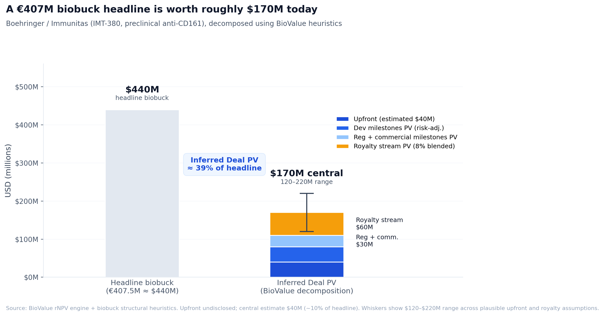

# Reading a biobuck: Boehringer / Immunitas through BioValue

On May 12, 2026, Boehringer Ingelheim and Immunitas Therapeutics announced a global license for IMT-380, a first-in-class anti-CD161 antibody for chronic inflammatory diseases.[^1] Headline number: up to €407.5M plus tiered royalties. The upfront was not disclosed.

This is a textbook biobuck. Most of the headline is aspirational milestone money. The real question for any BD analyst reading the announcement is what the actual value transfer looks like.

That is a BioValue question.

## What we know about the asset

IMT-380 is a fully human, Fc-active monoclonal antibody that selectively depletes pathogenic CD161+ T cells. CD161+ T cells produce IL-17A, IFN-γ, IL-22, TNF-α, and GM-CSF, and have been implicated in autoimmune tissue pathology. Preclinical data have been shown in Crohn's patient samples and in animal models of skin inflammation.[^2]

The asset is preclinical. No IND. The lead indication is not formally declared in the deal announcement, though the preclinical work points to inflammatory bowel disease (Crohn's) or atopic dermatitis as the anchor.

For modeling purposes:

- Stage: Preclinical (pre-IND)
- TA: Immunology & Inflammation
- Modality: Monoclonal antibody (validated)
- Differentiation: First-in-class flag on
- Cumulative PoS preclinical to approval in I&I antibodies: roughly 5 to 8 percent (Project ALPHA)[^3]

## BioValue inputs

Anchoring to IBD as the lead indication (US Crohn's prevalence around 750K patients, global biologic IBD market north of $25B), and assuming peak risk-unadjusted potential in the €1.5 to €2B range for a clinically differentiated FIC anti-CD161 antibody:

- Acquirer WACC: 8.5% (large-pharma Boehringer)
- Peak market share: 5% (FIC mechanism in a saturated biologic market)
- Commercial life: 12 years post-launch
- LoE haircut: 30%
- FIC flag on, no biomarker declared, no orphan, no BTD

## The three-value framework

**Standalone Asset rNPV** (Boehringer 8.5% WACC, FIC stacked, 5% peak share):

Roughly $280M central case. Defensible range $200 to $350M depending on indication and peak.

**Commercial-adjusted lower bound** (14% WACC, peak × 0.60, commercial PoS × 0.85):

Roughly $90 to $130M. The BD-realistic floor for an outside analyst with no insider conviction.

**Deal PV** (inferred, since the upfront is undisclosed):

Biobuck structural heuristics for preclinical I&I:

- Upfront 5 to 15 percent of headline biobuck → $20 to $65M
- Risk-adjusted near-term + development milestones → $30 to $50M PV
- Risk-adjusted regulatory + commercial milestones → $20 to $40M PV
- Royalty stream PV (8% blended on $1 to $2B risk-adjusted peak) → $40 to $80M PV

Sum: Deal PV roughly $120 to $220M.

## Where this lands

Deal PV / Asset rNPV ≈ 45 to 65 percent.

That sits inside the 30 to 65 percent empirical band established in [post 1](https://biovalue.substack.com/p/single-asset-drug-deals-are-more).[^4] Boehringer paid a normal preclinical FIC I&I price, with a normal upper-band premium for first-in-class novelty.

The €407.5M headline tells you very little. The components tell you almost everything:

- Upfront: real money, fully present-valued, the largest single Deal PV component for most biobucks
- Near-term milestones: heavily risk-adjusted, only 5 to 15 percent of the headline survives discount
- Late-stage milestones: deeply risk-adjusted, 10 to 25 percent survives
- Royalty stream: the other large Deal PV component, and the hardest to value because it depends on peak realization

For a seller, biobuck headlines maximize PR optics. For a buyer, they buy optionality on a long timeline at affordable upfront cost. For an outside analyst, the headline is nearly useless without the structure underneath it.

## What would sharpen this

Three numbers would tighten the analysis materially:

1. **The upfront.** Moves Deal PV by $30 to $50M directly.
2. **The declared lead indication.** Changes peak by ±$500M to $1B.
3. **The royalty tier breakdown.** Royalty PV is one of the two largest Deal PV components for biobucks. 8% vs 12% blended changes the total by 20 to 30 percent.

Until those land, the deal is a normally-priced preclinical FIC I&I biobuck, sitting inside the band.

The deal is loaded as an IMT-380 / Boehringer preset in [BioValue](https://nealvybe.github.io/biovalue/). Open it, drop in your own upfront estimate, run the comparison.

[^1]: Boehringer Ingelheim and Immunitas Therapeutics press release, May 12 2026. Coverage at Fierce Biotech and Pharmaphorum.
[^2]: Immunitas IMT-380 preclinical data, FASEB Science Research Conference on Autoimmunity 2025.
[^3]: MIT Project ALPHA, phase-transition probability database (I&I antibody preclinical to approval).
[^4]: BioValue Substack, ["Single-asset drug deals…"](https://biovalue.substack.com/p/single-asset-drug-deals-are-more).
