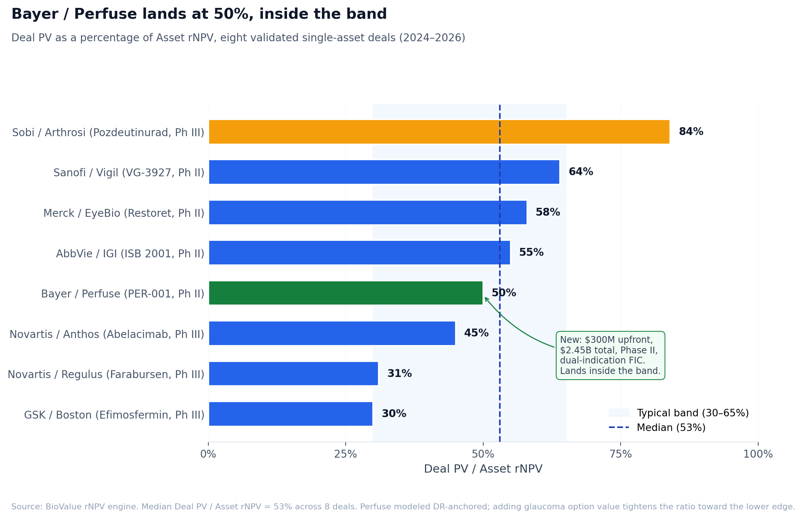

# Decomposing a $2.45B headline: Bayer / Perfuse through BioValue

On May 6, 2026, Bayer announced an acquisition of Perfuse Therapeutics for up to $2.45B: $300M upfront, $2.15B in development, regulatory, and commercial milestones.[^1] The asset is PER-001, a Phase II endothelin receptor antagonist delivered as a sustained-release intravitreal implant, in development for both diabetic retinopathy and glaucoma.

The headline reads aggressive: $2.45B for a Phase II asset. Run it through BioValue, and the math reads fair value.

## What we know about the asset

PER-001 is a small molecule endothelin receptor antagonist formulated as a bio-erodible intravitreal implant.[^2] Sustained release, single-use 25-gauge applicator. Phase II for diabetic retinopathy (DR) and glaucoma. Perfuse positions PER-001 as a potential first disease-modifying treatment for both, contrasting with current anti-VEGFs targeting DME and IOP-lowering drops in glaucoma.

For modeling, anchor to DR. It is the larger high-value market and aligns with Bayer's existing retina franchise around Eylea.

- Stage: Phase II
- TA: Ophthalmology
- Modality: Small molecule (sustained-release implant)
- Mechanism: Endothelin receptor antagonist
- WACC: 8.0% (Bayer)
- FIC flag on
- Phase II to approval PoS in ophthalmology, FIC-stacked: roughly 35 to 40 percent[^3]

Glaucoma upside is treated as option value, not modeled in the single-indication anchor.

## Three-value framework

**Standalone Asset rNPV** (Bayer 8.0% WACC, FIC, DR-anchored, ~18% peak share):

Roughly $1.5 to $2.0B central case, $1.8B point estimate.

**Commercial-adjusted lower bound** (14% WACC, peak × 0.60, commercial PoS × 0.85):

Roughly $450 to $600M. The BD-realistic floor.

**Deal PV** (acquisition, no royalty):

- Upfront: $300M, fully present-valued
- Risk-adjusted dev milestones PV: ~$200M
- Risk-adjusted regulatory milestones PV: ~$150M
- Risk-adjusted commercial milestones PV: ~$280M

Total Deal PV: roughly $800M to $1.0B, $900M point estimate.

## Where this lands

Deal PV / Asset rNPV ≈ 45 to 55 percent.

That sits inside the 30 to 65 percent empirical band.[^4]

The $2.45B headline tells you very little. The components tell you almost everything:

- $300M upfront is roughly 12 percent of the headline. That is within the typical 5 to 20 percent range for Phase II acquisitions.
- $2.15B in milestones is aspirational. Risk-adjusted to today, those milestones contribute only $600 to $700M of present value.
- No royalty, because this is an acquisition. Bayer captures full economics post-close, so the licensing-deal royalty layer disappears.

Risk-adjusted Deal PV of $0.9B against a single-indication Asset rNPV of $1.8B is a fair-value transaction by every comp in the BioValue validation set. The deal looks aggressive in press release dollars because the milestones are nominal, not present-valued.

## The glaucoma option

Single-indication anchor understates what Bayer is buying. PER-001 has a Phase II program in glaucoma, and the disease-modification claim positions it for a premium segment of a much larger patient population (around 3 million US glaucoma patients versus around 1 million treated DR patients).

If glaucoma is added as a second commercial indication at roughly 50 percent of DR's peak revenue contribution, Asset rNPV broadens from $1.8B central to roughly $2.7B. Deal PV / Asset rNPV drops to 30 to 40 percent, still inside the band, just at the lower edge.

The dual-indication framing doesn't change the conclusion. The deal is inside the band either way.

## The structural read

Three things show up in this deal that don't show up in the headline:

1. **Strategic context.** Bayer's Eylea franchise is exposed to biosimilar erosion. PER-001 is a pipeline rebuild bet for the retina business. The asset has a franchise role, not just a standalone NPV.
2. **Dual indication.** Single-asset rNPV anchored to DR ignores glaucoma option value. Adding glaucoma tightens Deal PV / Asset rNPV from mid-band toward lower-band.
3. **No royalty.** Acquisition structure means Bayer captures full economics post-launch. For a licensing deal of similar economics, the royalty stream would shift Deal PV up by 20 to 30 percent.

## The takeaway

Headlines optimize for press release optics. Decomposing a deal into upfront + risk-adjusted milestones + (when applicable) royalty PV is what tells you whether a buyer overpaid. By that decomposition, Bayer paid fair value for a Phase II FIC ophthalmology asset with a strategic franchise role and dual-indication option value.

The 30 to 65 percent band keeps holding. Aggressive-looking headlines aren't the same as premium pricing. They're the headline number multiplied by the milestone risk discount.

The deal is now a Perfuse preset in BioValue.[^5] Toggle the share assumption, layer in glaucoma, watch the band move.

[^1]: Bayer press release, May 6 2026; Fierce Biotech and Pharmaphorum coverage.
[^2]: Perfuse Therapeutics company communications.
[^3]: MIT Project ALPHA, phase-transition probability database (ophthalmology small molecule, Phase II to approval).
[^4]: BioValue Substack, ["Single-asset drug deals…"](https://biovalue.substack.com/p/single-asset-drug-deals-are-more).
[^5]: nealvybe.github.io/biovalue, Perfuse / PER-001 preset.
